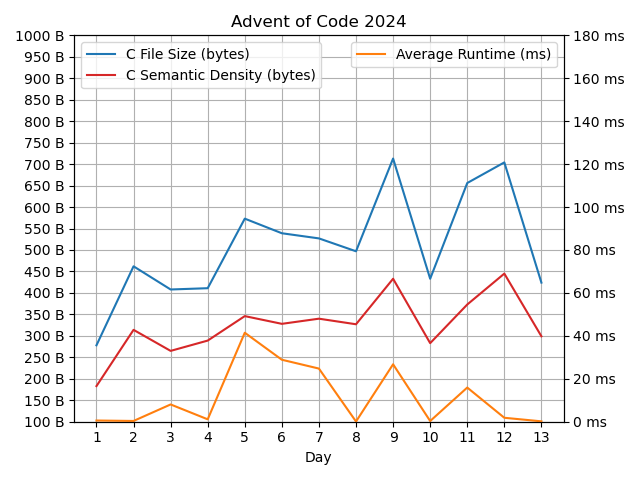

# aoc2024



## Miscellany

Perl one-liner for day 3 part 1:
```perl
perl -nE '$s+=$1*$2while/mul\((\d+),(\d+)\)/g}{say$s' d03.txt
```

Flex scanner for day 3 (both parts):
```
%{
  int p1, p2, on=1, x, y; /* A compact Flex scanner for day 3 */
%}
%%
mul\([0-9]+,[0-9]+\) sscanf(yytext+4,"%d,%d",&x,&y);p1+=x*=y;p2+=on*x;
do(n\'t)?"()" on=!yytext[4];
.|\n { }
%%
int yywrap(){}int main(){yylex();printf("T1: %d, T2: %d\n",p1,p2);}
```